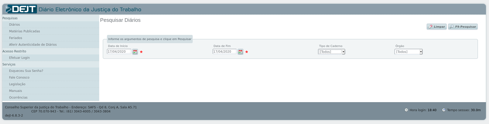
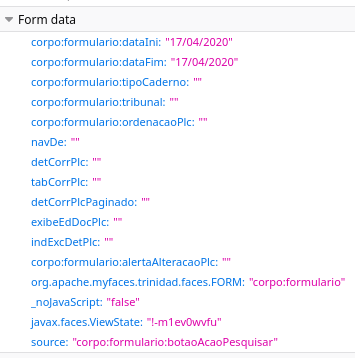
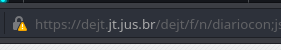
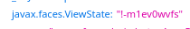
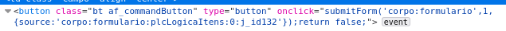

```{r setup, include=FALSE}
library(magrittr)
options(htmltools.dir.version = FALSE)
knitr::opts_chunk$set(comment = "#>")
```

```{r xaringan-themer, include=FALSE}
library(xaringanthemer)
mono_light(
  base_color = "#1c5253",
  header_font_google = google_font("Arvo"),
  text_font_google   = google_font("Montserrat", "400", "500"),
  text_font_size     = "24px",
  code_font_google   = google_font("Droid Mono")
)
```

class: inverse, center, middle
# XPath

---
# HTML

```{r}
library(xml2)
library(httr)
library(purrr)
```

---
class: inverse, center, middle
# Iteração

---
# O fluxo do web scraping

- Sempre que fazemos um web scraper é bom seguir um fluxo definido

- Por enquanto já foram apresentados elementos da maior parte do passo-a-passo,
mas nada foi dito sobre a iteração

```{r, echo = FALSE, dpi = 100, fig.align='center'}
knitr::include_graphics("static/cycle.png")
```

---
# Por que iterar?

- Dificilmente queremos fazer uma tarefa de web scraping uma vez só (senão
bastaria baixar a página uma vez e raspá-la)

- Podemos querer baixar muitas páginas de uma vez ou uma página a cada certo
tempo

- Iteração, tratamento de erros e automatização passam a ser relevantes

  - O pacote `purrr` nos ajudará a iterar
  
  - O pacote `purrr` retornará para tratar qualquer erro que possa aparecer
  
  - O pacote `cronR` nos ajudará a agendar a execução de scripts

- Se você estiver interessado em aprender mais, veja nosso curso de 
[Deploy](https://www.curso-r.com/cursos/deploy/)

---
# Iterar

- Iteração é um padrão de programação extremamente comum que pode ser altamente
abreviado

```{r}
nums <- 1:10
resp <- c()
for (i in seq_along(nums)) {
  resp <- c(resp, nums[i] + 1)
}
resp
```

```{r, message=FALSE}
library(purrr)
map_dbl(nums, ~.x + 1)
```

---
# A função map

- A função `map()` recebe um vetor ou uma lista de entrada e aplica uma função
em cada elemento do mesmo

- Podemos especificar o formato da saída com a família de funções `map_***()`

- A função pode ser declarada externamente, internamente ou através de um
_lambda_

```{r, eval=FALSE}
soma_um <- function(x) {
  x + 1
}

map(nums, soma_um)
map(nums, function(x) x + 1)
map(nums, ~.x + 1)
```

---
# Utilidade do map

- Se tivermos uma lista de URLs, podemos iterar facilmente em todos sem abrir
mão da síntaxe maravilhosa do Tidyverse

```{r}
library(xml2)
urls <- c(
  "https://en.wikipedia.org/wiki/R_language",
  "https://en.wikipedia.org/wiki/Python_(programming_language)"
)

urls %>%
  map(read_html) %>%
  map(xml_find_first, "//h1") %>%
  map_chr(xml_text)
```

---
# Tratando problemas

- Ao repetir uma tarefa múltiplas vezes, não podemos garantir que toda execução
funcione

- O R já possui o `try()` e o `tryCatch()`, mas o `purrr` facilita ainda mais
o trabalho

```{r, error = TRUE}
maybe_read_html <- possibly(read_html, NULL)

read_html("https://errado.que")
maybe_read_html("https://errado.que")
```

---
# Agendamento

- Infelizmente o pacote mais comum (`cronR`) não funciona no Windows, nele é
necessário usar o `taskscheduleR`

```{r, eval = FALSE}
library(cronR)
cmd <- cron_rscript("CAMINHO PARA SCRIPT")

cron_add(cmd, "daily", "00:00")
cron_add(cmd, "daily", "14:20", days_of_week = c(0, 3, 5))
cron_add(cmd, "monthly", "10:30", days_of_month = "first")
cron_add(cmd, '@reboot')
```

- Também é possível utilizar uma interface interativa no RStudio em **Addins >
Schedule R scripts**

---
# Exercício (eu)

Na página da Wikipédia, encontrar o objeto correspondente à tabela lateral de
informações. Pegar apenas os elementos correspondentes a links.

--

```{r}
links <- "https://en.wikipedia.org/wiki/R_language" %>%
  read_html() %>%
  xml_find_all("//table[@class='infobox vevent']//a")

head(links)
```

---
# Exercício (nós)

Extrair todos os URLs dos links e completá-los com o resto do caminho da
Wikipédia. Continuar usando apenas _pipes_.

--

```{r, warning=FALSE}
urls <- "https://en.wikipedia.org/wiki/R_language" %>%
  read_html() %>%
  xml_find_all("//table[@class='infobox vevent']//a") %>%
  xml_attr("href") %>%
  paste0("https://en.wikipedia.org", .)

head(urls)
```

---
# Exercício (vocês)

Baixar todas as páginas da Wikipédia. Dicas: use `possibly()` para impedir erros
quando o URL for inválido; procure saber sobre a função `map2()` para iterar em
mais de uma lista; salve os arquivos com `GET(..., write_disk(path))`.

```{r, echo=FALSE}
dir <- paste0(tempdir(), "/")
```

--

```{r}
library(httr)
paths <- paste0(dir, seq_along(urls), ".html")

maybe_get <- function(url, path) {
  possibly(GET, NULL)(url, write_disk(path))
}

out <- map2(urls, paths, maybe_get)
length(compact(out))
```

---
class: inverse, center, middle
# Paralelismo

---
# O que isso significa?

- Antigamente, computadores eram capazes de executar apenas uma sequência de
comandos por vez

- Avanços tecnológicos permitiram que o processador fosse capaz de fazer
"malabarismo" com diversos processos

- Paralelismo (ou multiprocessamento) chegou apenas com os primeiros _dual-core_

```{r, dpi = 110, fig.align='center', echo=FALSE}
knitr::include_graphics("static/cores.png")
```

---
# Em mais detalhes

- A unidade de processamento central pode ter mais de um **núcleo**
(_multicore_)

- Um **processo** é composto por uma sequência de comandos ou tarefas

- Cada núcleo consegue executar apenas um **comando** por vez

- Os comandos de um processo podem ser interrompidos para que sejam executados
os de outro (_multitasking_)

- O computador pode executar várias tarefas simultaneamente escalonando os
comandos para seus diferentes núcleos (_multithreading_)

- Muitos computadores possuem **núcleos vírtuais**, permitindo dois comandos por
vez em cada núcleo (_hyperthreading_)

---
# Exemplo mínimo

O pacote `parallel` já vem instalado junto com o R e consegue rodar comandos
paralelamente tanto no Windows quanto em outros sistemas. Por padrão, ele quebra
a tarefa em 2.

```{r}
library(parallel)
library(microbenchmark)

microbenchmark(
  seq = map_dbl(1:10000, function(x) x + 1),
  par = mclapply(1:10000, function(x) x + 1)
)
```

---
# Futuros

- O pacote `future` expande o pacote `parallel`, permitindo o descolamento de
tarefas da sessão principal

  - Ele pode operar em 2 níveis: _multicore_ e _multissession_
  
- Em cima do `future`, for construído o `furrr` com o objetivo de emular a
síntaxe do `purrr` para processamento paralelo

- Diferentemente do `parallel`, o `future` é capaz de descobrir sozinho o número
de núcleos virtuais do computador

```{r}
library(future)
availableCores()
```

---
# Exercício (eu)

Estabelecer um plano de execução paralela com a função `plan()`. Entender a
diferença entre todos os planos disponíveis.

--

```{r, warning=FALSE, message=FALSE}
plan(multiprocess)
```

- `sequential`: não executa em paralelo, útil para testes

- `multicore`: mais eficiente, não funciona no Windows nem dentro do RStudio

- `multisession`: abre novas sessões do R, mais pesado para o computador

- `multiprocess`: escolhe o melhor entre `multicore` e `multisession`

---
# Exercício (nós)

Criar uma função que retorna o primeiro parágrafo de uma página da Wikipédia
dado o fim de seu URL (como "/wiki/R\_language"). Dicas: textos são denotados
pela _tag_ `<p>` em HTML; pule o elemento de classe "mw-empty-elt".

```{r}
download_wiki <- function(url) {
  url %>%
    paste0("https://en.wikipedia.org", .) %>%
    read_html() %>%
    xml_find_first("//p[not(@class='mw-empty-elt')]") %>%
    xml_text()
}
```


---
# Exercício (vocês)

Executar a função anterior em paralelo para todas as páginas baixadas no
exercício de iteração. Dicas: utilize `future_map()` do pacote `furrr`; não se
esqueça do `possibly()`"!

```{r, warning=FALSE, message=FALSE}
library(furrr)

prgs <- "https://en.wikipedia.org/wiki/R_language" %>%
  read_html() %>%
  xml_find_all("//table[@class='infobox vevent']//a") %>%
  xml_attr("href") %>%
  future_map(possibly(download_wiki, ""))

prgs[[3]]
```

```{r, echo=FALSE}
plan(sequential)
```

---
class: inverse, center, middle
# Selenium

---
# O que é Selenium?

- Selenium é uma ferramenta que permite **automatizar um navegador**!

- Suporta alguns _backends_ diferentes: PhantomJS, Firefox, Chrome, etc.

- Diferentemente do web scraping normal, não precisamos nos preocupar com
nenhuma requisição HTTP

  - O Selenium literalmente cria um navegador invisível para o qual você pode
  passar as **ações** a serem tomadas
  
  - Por ser uma sessão interativa, não há dificuldades em exibir conteúdo
  dinâmico

  - Não é necessário compreender o _networking_ do site: tudo é _headless_
  
---
# Por que não usá-lo sempre?

- Vantagens:

  - Fácil de entender
  
  - Permite raspar dados dinâmicos
  
  - Permite _screen shots_

- Desvantagens:
  
  - Lento e de difícil paralelização
  
  - Bastante sensível
  
  - `RSelenium` está **completamente quebrado**

---
# WebDriver

- Não existe uma diferença real entre "Selenium" e "WebDriver"

  - O nome correto da ferramenta é Selenium WebDriver

- A diferença está no R: pacotes `RSelenium` e `webdriver`

  - `RSelenium` essencialmente não funciona
  
  - `webdriver` foi feito pela própria RStudio para resolver o problema

- O `webdriver` funciona somente com o PhantomJS, mas isso não é necessariamente
um problema

- Instalar é fácil, fazer funcionar é mais ainda

---
# PhantomJS

- O PhantomJS é um navegador _headless_ baseado em JavaScript feito
especificamente para interação automatizada com páginas da web

```{r}
library(webdriver)
# webdriver::install_phantomjs()

pjs <- run_phantomjs()
pjs
ses <- Session$new(port = pjs$port)
```

---
# Exemplo mínimo

```{r, echo=FALSE, warning=FALSE}
arq <- tempfile(fileext = ".png")
```

```{r}
ses$go("https://google.com")
ses$takeScreenshot(file = arq)
```

```{r, echo=FALSE, fig.align='center'}
arq %>%
  magick::image_read() %>%
  magick::image_crop("x600") %>%
  magick::image_resize("450x")
```

---
# Elementos

- `ses$findElement()` retorna um elemento da página dado um seletor ou XPath
para o mesmo

  - É uma função embutida na sessão (assim como `takeScreenshot()` e `go()`)

- `elem$click()` clica em um elemento, enquanto `elem$sendKeys()` "envia" uma
tecla para o elemento

  - São funções embutidas no elemento retornado por `findElement()`

  - A lista `key` contém uma série de teclas que podem ser enviadas (como ENTER,
  etc.)
  
  - Ao invés de `elem$sendKeys()` podemos usar `elem$setValue()` para escrever
  um texto no elemento caso isso seja possível

---
# Exercício (eu)

Encontrar a página de Fundos de Investimento da XP. Criar uma sessão `webdriver`
para ir até esta página.

--

```{r}
xp <- paste0(
  "https://institucional.xpi.com.br/investimentos/",
  "fundos-de-investimento",
  "/lista-de-fundos-de-investimento.aspx"
)
ses$go(xp)
ses$takeScreenshot(file = arq)
```

---
# Exercício (eu)

```{r, echo=FALSE, fig.align='center'}
arq %>%
  magick::image_read() %>%
  magick::image_crop("x700") %>%
  magick::image_resize("500x")
```

---
# Exercício (nós)

Fazer a sessão `webdriver` clicar na aba "Internacional" no topo da página.

--

```{r}
elem <- ses$findElement(xpath = '//a[@href="#referenciado"]')
elem$click()
ses$takeScreenshot(file = arq)
```

---
# Exercício (nós)

```{r, echo=FALSE, fig.align='center'}
arq %>%
  magick::image_read() %>%
  magick::image_crop("x700") %>%
  magick::image_resize("500x")
```

---
# Exercício (vocês)

Filtrar apenas os fundos de alto risco. Dica: podemos selecionar um elemento de
uma lista com as setas do teclado (analizar `key`) ou podemos obter a estrutura
da lista de seleções.

--

```{r}
tab <- "//div[@id='tableReferenciadoRisk']"
opt <- paste0(tab, "/span/select/option[@value='5']")

elem <- ses$findElement(xpath = tab)
elem$click()
Sys.sleep(2)
elem <- ses$findElement(xpath = opt)
elem$click()

ses$takeScreenshot(file = arq)
```

---
# Exercício (vocês)

```{r, echo=FALSE, fig.align='center'}
arq %>%
  magick::image_read() %>%
  magick::image_crop("x700") %>%
  magick::image_resize("500x")
```

---
# Quer mais?

- O PhantomJS, apesar de muito capaz, ainda não consegue exibir todo o conteúdo
dinâmico de uma página

- Para solucionar esse problema, é necessário usar o RSelenium com um navegador
de verdade como backend

  - Nem sempre a instalação do `RSelenium` funciona e em alguns sistemas
  operacionais há outras dependências
  
  - A documentação do `RSelenium` está atrasadas, dificultando qualquer pesquisa
  
  - O método sugerido para utilizar navegadores externos depende do Docker,
  um programa sem relação com o R
  
- Não use `RSelenium` caso não seja estritamente necessário!

---
# Demonstração

- As funções do `RSelenium` são parecidas com as do `webdriver`, mas envolvem um
mais esforço

- No exemplo abaixo, o `RSelenium` abre uma aba do Firefox no meu computador e
executa todos os comandos ao vivo nela

```{r message=FALSE, warning=FALSE, results='hide'}
library(RSelenium)
drv <- rsDriver(browser = "firefox", verbose = FALSE)

drv$client$navigate("https://google.com")
elem <- drv$client$findElement("xpath", "//input[@name='q']")
elem$sendKeysToElement(list("ibovespa", key = "enter"))

Sys.sleep(2)
drv$client$screenshot(file = arq)
```

---
# Demonstração

```{r, echo=FALSE, fig.align='center'}
tr <- drv$server$stop()
arq %>%
  magick::image_read() %>%
  magick::image_crop("x700") %>%
  magick::image_resize("500x")
```

---
# Mas com o webdriver...

- Note a presença do gráfico interativo na imagem anterior, isso não é possível
com o `webdriver`

- Pelas limitações do PhantomJS, nem todo elemento dinâmico pode ser renderizado
na tela

  - É possível usar o `webdriver` com Docker também, mas nesse caso é melhor
  recorrer ao `RSelenium`

```{r}
ses$go("https://google.com")
elem <- ses$findElement(xpath = "//input[@name='q']")
elem$sendKeys("ibovespa", key$enter)

Sys.sleep(2)
ses$takeScreenshot(file = arq)
```

---
# Mas com o webdriver...

```{r, echo=FALSE, fig.align='center'}
arq %>%
  magick::image_read() %>%
  magick::image_crop("x700") %>%
  magick::image_resize("500x")
```

---
class: inverse, center, middle
# Miscelânea

---
# O DEJT

- O Diário Eletrônico da Justiça do Trabalho é publicado (quase) todo dia e
contém todas as movimentações de vários tribunais do trabalho

- O nosso objetivo é baixar o PDF do diário para um dia específico

```{r, echo=FALSE, fig.align='center'}

```

---
# A busca

- Para buscar os diários de um dia, basta entrar no site e escolher o dia
correspondente

- Analisando o POST, vemos que não há muita dificuldade em reproduzir a
requisição

```{r, echo=FALSE, dpi = 120, fig.align='center'}

```

---
# Requisição da busca

```{r}
body <- list(
  "corpo:formulario:dataIni" = "17/04/2020",
  "corpo:formulario:dataFim" = "17/04/2020",
  "corpo:formulario:tipoCaderno" = "",
  "corpo:formulario:tribunal" = "",
  "corpo:formulario:ordenacaoPlc" = "",
  "navDe" = "",
  "detCorrPlc" = "",
  "tabCorrPlc" = "",
  "detCorrPlcPaginado" = "",
  "exibeEdDocPlc" = "",
  "indExcDetPlc" = "",
  "org.apache.myfaces.trinidad.faces.FORM" = "corpo:formulario",
  "_noJavaScript" = "false",
  "javax.faces.ViewState" = "!-m1ev0wvfu",
  "source" = "corpo:formulario:botaoAcaoPesquisar"
)
```

---
# Reproduzindo a busca

```{r, error=TRUE}
url <- "https://dejt.jt.jus.br/dejt/f/n/diariocon"
POST(url, body = body)
```

- A primeira tentativa não funcionou por causa de um erro no certificado SSL

- SSL é o nome antigo para TLS (_Transport Layer Security_), uma ferramenta que
permite que exista o HTTPS

  - HTTPS é a versão secura e criptografada do HTTP, o protocolo da _web_
  
- Essencialmente, isso quer dizer que a página do DEJT tem vulnerabilidade

```{r, echo=FALSE, fig.align='center'}

```

---
# Reproduzindo a busca 2

```{r}
resp <- POST(
  url, body = body,
  config(ssl_verifypeer = FALSE)
)
length(resp$content)
```

- Apesar de a consulta ter funcionado, o tamanho da resposta (16kB) não está nem
próximo do esperado

- Isso ocorre porque a página espera um POST do tipo formulário

  - A única diferença é o formato em que os dados serão enviados ao servidor

```{r, echo=FALSE, fig.align='center'}

```

---
# Reproduzindo a busca 3

```{r}
resp <- POST(
  url, body = body, encode = "form",
  config(ssl_verifypeer = FALSE)
)
length(resp$content)
```

- Ainda sem sucesso, precisamos começar a conferir o formulário

- Se saírmos da página e tentarmos copiar o POST de novo, notaremos que o
Viewstate mudou

```{r, echo=FALSE, fig.align='center'}

```

---
# Viewstate

- O JSF ViewState é um campo escondido que carrega consigo informações sobre o
estado de uma sessão do navegador

- Ele é capaz de indicar para a próxima página acessada o que tinha acontecido
até aquele momento

- No nosso caso o Viewstate é relevante apenas porque muitas páginas dependem
dele para funcionar

```{r}
# Procurando o Viewstate na página anterior à busca
viewstate <- url %>%
  GET(config(ssl_verifypeer = FALSE)) %>%
  content() %>%
  xml_find_first('//input[@name="javax.faces.ViewState"]') %>%
  xml_attr("value")
```

---
# Reproduzindo a busca 4

```{r}
body$javax.faces.ViewState <- viewstate
resp <- POST(
  url, body = body, encode = "form",
  config(ssl_verifypeer = FALSE)
)
length(resp$content)
```

- Agora que a resposta está correta, podemos continuar a raspagem da página sem
mais problemas

- Basta identificar como baixar cada um dos PDFs

```{r, echo=FALSE, fig.align='center'}

```

---
# Encontrando o PDF

- Assim como outras páginas feitas com Java, grande parte dos elementos
interativos do DEJT possui um identificador único

- No nosso caso, precisamos encontrar o ID dos PDFs antes de poder baixá-los

```{r}
jid <- resp %>%
  read_html() %>%
  xml_find_all("//button") %>%
  xml_attr("onclick") %>%
  stringr::str_extract("(?<=plcLogicaItens:0:)j_id[0-9]+") %>%
  extract(!is.na(.))
```

---
# Requisição do PDF

```{r}
body2 <- list(
  "corpo:formulario:dataIni" = "17/04/2020",
  "corpo:formulario:dataFim" = "17/04/2020",
  "corpo:formulario:tipoCaderno" = "",
  "corpo:formulario:tribunal" = "",
  "corpo:formulario:ordenacaoPlc" = "",
  "navDe" = "",
  "detCorrPlc" = "",
  "tabCorrPlc" = "",
  "detCorrPlcPaginado" = "",
  "exibeEdDocPlc" = "",
  "indExcDetPlc" = "",
  "org.apache.myfaces.trinidad.faces.FORM" = "corpo:formulario",
  "_noJavaScript" = "false",
  "javax.faces.ViewState" = viewstate,
  "source" = paste0("corpo:formulario:plcLogicaItens:0:", jid)
)
```

---
# Baixando o PDF

```{r, echo=FALSE}
arq <- tempfile(fileext = ".pdf")
```

- Baixar um PDF funciona da mesma forma que baixar um HTML para o disco do
computador, basta utilizar a função `write_disk()`

```{r}
POST(
  url, body = body2,
  write_disk(arq, TRUE),
  config(ssl_verifypeer = FALSE)
)
```

```{r, echo=FALSE,}
tr <- file.remove(arq)
```
